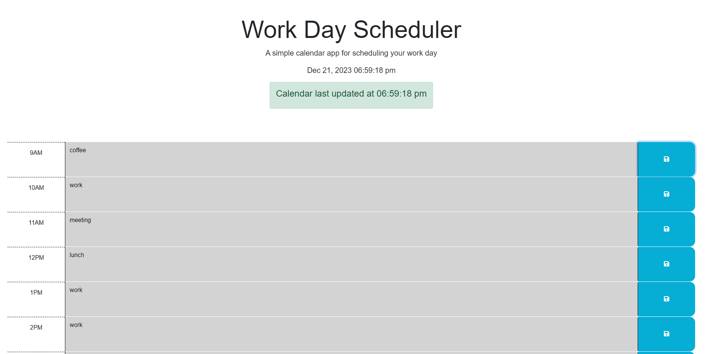

# Worday Planner
## Description
This is a planner meant for a user to add tasks for their day. Users can add and edit input for each block, and the calendar will let the user know the time, date, which blocks are upcoming, and when their content is saved.

## Usage
Follow the link:

https://codeclass0.github.io/planner/

Screenshot: 

